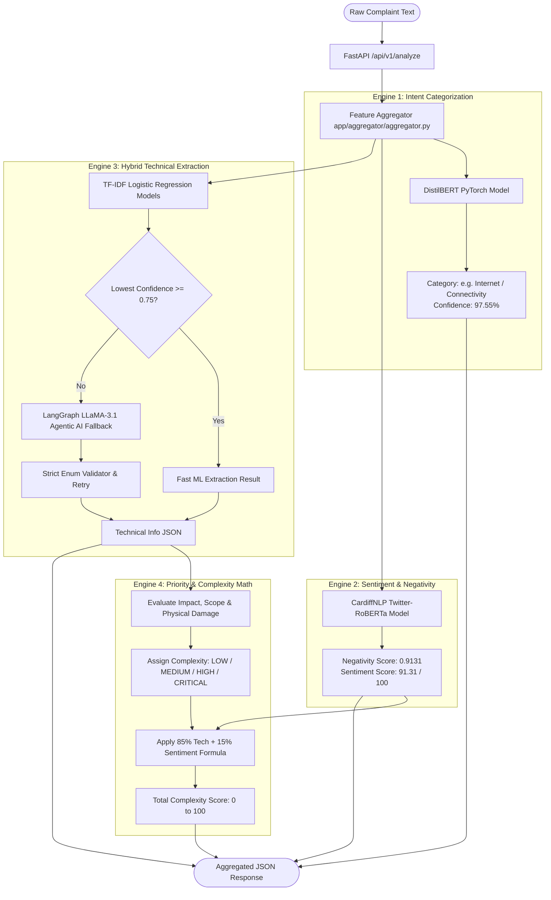
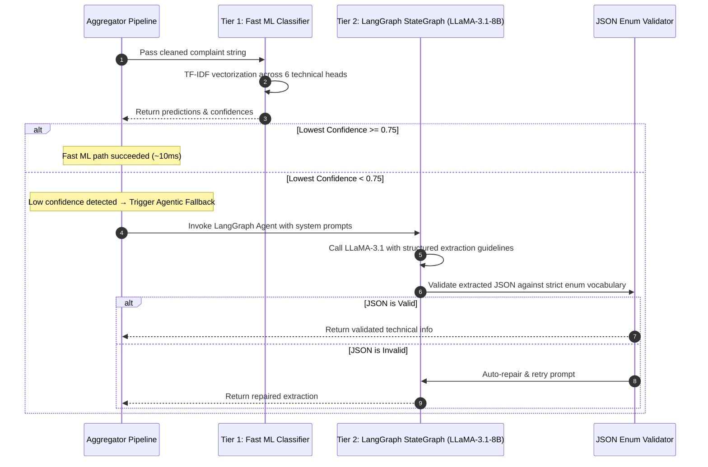

# 🤖 Telecom AI & ML Inference Service (`telecom-ai-service`)

A high-performance, stateless **AI/ML/NLP inference microservice** designed for real-time customer complaint triage, multi-class categorization, sentiment scoring, hybrid technical information extraction, and automated complexity prioritization.

---

## 🏗️ 1. High-Level AI Architecture Flow

When a complaint text is received at `POST /api/v1/analyze`, it passes through 4 parallel and cascaded intelligence engines:



---

## 🔬 2. Deep Dive: The 4 Intelligence Engines

---

### 🏷️ Engine 1: Complaint Categorization (DistilBERT)
* **Model**: Fine-tuned `distilbert-base-uncased` PyTorch sequence classifier located in [`Model/distilbert_category_model`](file:///Users/admin/Desktop/CTS/telecom-ai-service/Model/distilbert_category_model).
* **Target Categories**:
  1. `Internet / Connectivity`
  2. `Billing & Payments`
  3. `Customer Service`
  4. `Email & Account Access`
  5. `Other General Inquiry`
* **How It Works**:
  1. Tokenizes text with `DistilBertTokenizer`.
  2. Computes Softmax probabilities across all 5 classes.
  3. Returns predicted category name and float confidence (e.g. `0.9755`).

---

### 💔 Engine 2: Sentiment & Negativity Scorer (RoBERTa)
* **Model**: `cardiffnlp/twitter-roberta-base-sentiment-latest`
* **Mathematical Formula**:
  RoBERTa outputs probabilities for $[P(\text{Negative}), P(\text{Neutral}), P(\text{Positive})]$.
  $$\text{negativity\_score} = P(\text{Negative}) + 0.2 \times P(\text{Neutral})$$
  $$\text{sentiment\_score} = \text{negativity\_score} \times 100$$
* **Score Scale**:
  - `0.0 – 30.0`: Mild / Neutral inquiry
  - `30.0 – 60.0`: Moderately frustrated
  - `60.0 – 100.0`: Highly negative / severe dissatisfaction

---

### 🔍 Engine 3: Hybrid Information Extraction (ML + LangGraph LLM Agent)

To achieve **maximum throughput and 100% extraction accuracy**, the extraction engine uses a **Hybrid Two-Tier Architecture**:



#### Extracted Dimensions:
1. **`component`**: `["fiber_cable"]`, `["network_tower"]`, `["router"]`, `["modem"]`, `["sim_card"]`, `["landline"]`, `["general_broadband"]`.
2. **`failure_type`**: `["physical_damage"]`, `["complete_outage"]`, `["intermittent_connection"]`, `["slow_speed"]`, `["billing_error"]`, `["no_signal"]`.
3. **`scope`**: `individual` | `multiple_users` | `area_wide`.
4. **`service_impact`**: `complete_outage` | `degraded` | `intermittent`.
5. **`duration_hours`**: Float or `null`.
6. **`occurrence_pattern`**: `one_time` | `recurring`.

---

### ⚖️ Engine 4: Priority & Total Complexity Math Engine

The priority engine combines **objective technical impact (85%)** with **customer emotional urgency (15%)**:

#### 1. Technical Complexity Calculation:
* **Base Score**:
  - `complete_outage`: Base **70**
  - `degraded`: Base **40**
  - `intermittent`: Base **30**
* **Modifiers**:
  - `multiple_users` / `area_wide`: **+15**
  - `physical_damage`: **+10**
* **Critical Override Rules**:
  - If `physical_damage` + `network_tower` / `fiber_cable` + `complete_outage` $\rightarrow$ Score is overridden to **100** (`CRITICAL`).

#### 2. Weighted Total Complexity Formula:
$$\text{weighted\_complexity\_score} = \text{complexity\_score} \times 0.85$$
$$\text{weighted\_negativity\_score} = \text{sentiment\_score} \times 0.15$$
$$\mathbf{\text{total\_complexity\_score}} = \text{weighted\_complexity\_score} + \text{weighted\_negativity\_score}$$

#### 3. Classification Thresholds:
| Total Score Range | Priority Label | Technician Dispatch SLA |
|---|---|---|
| **`80.0 – 100.0`** | 🔴 **`CRITICAL`** | Immediate (within 2 hours) |
| **`60.0 – 79.9`** | 🟠 **`HIGH`** | High Priority (within 6 hours) |
| **`35.0 – 59.9`** | 🟡 **`MEDIUM`** | Standard Queue (within 24 hours) |
| **`0.0 – 34.9`** | 🟢 **`LOW`** | Self-Service / Knowledge Base / RAG |

---

## 📡 3. API Endpoints Reference

Base URL: `http://localhost:8001`

### 1. `POST /api/v1/analyze` (Main Pipeline)
Orchestrates all 4 engines and returns the full intelligence payload.

#### Request:
```json
{
  "complaint": "the network tower near my house got bursted, leaving our whole area with zero signal"
}
```

#### Response:
```json
{
  "complaint": "the network tower near my house got bursted, leaving our whole area with zero signal",
  "category": "Internet / Connectivity",
  "category_confidence": 0.9812,
  "negativity_score": 0.9131,
  "sentiment_score": 91.31,
  "extraction_source": "llm",
  "lowest_confidence": 0.21,
  "technical_information": {
    "component": ["network_tower"],
    "failure_type": ["physical_damage"],
    "scope": "area_wide",
    "service_impact": "complete_outage",
    "duration_hours": null,
    "occurrence_pattern": "one_time"
  },
  "solution_a": "Automated Triage: Dispatch field engineering team immediately for network_tower physical_damage repair and inspect local transmission relays.",
  "complexity": "CRITICAL",
  "complexity_score": 100,
  "weighted_complexity_score": 85.0,
  "weighted_negativity_score": 13.6965,
  "total_complexity_score": 98.6965
}
```

---

### 2. `POST /api/v1/categorize`
Runs standalone DistilBERT intent classification.

#### Request:
```json
{
  "complaint": "my bill shows incorrect roaming charges for last month"
}
```
#### Response:
```json
{
  "category": "Billing & Payments",
  "confidence": 0.9942
}
```

---

### 3. `POST /api/v1/sentiment`
Runs standalone RoBERTa sentiment & negativity scoring.

#### Request:
```json
{
  "complaint": "terrible connection, internet disconnected during my job interview!"
}
```
#### Response:
```json
{
  "negativity_score": 0.9412,
  "sentiment_score": 94.12
}
```

---

### 4. `POST /api/v1/extract`
Runs standalone hybrid information extraction.

#### Request:
```json
{
  "complaint": "fiber cable damaged outside building"
}
```
#### Response:
```json
{
  "technical_information": {
    "component": ["fiber_cable"],
    "failure_type": ["physical_damage"],
    "scope": "individual",
    "service_impact": "complete_outage",
    "duration_hours": null,
    "occurrence_pattern": "one_time"
  },
  "extraction_source": "llm",
  "lowest_confidence": 0.262
}
```

---

## 🛠️ 4. Quick Start & Execution

### 1. Install Dependencies with `uv`
```bash
cd telecom-ai-service
uv sync
```

### 2. Run the AI Microservice Locally
```bash
uv run uvicorn app.main:app --reload --port 8001
```
*Interactive Swagger Documentation available at [http://localhost:8001/docs](http://localhost:8001/docs).*

### 3. Run the Automated Pytest Suite
```bash
uv run pytest
```
*All 16 unit, integration, and agentic AI test cases will execute and validate.*
