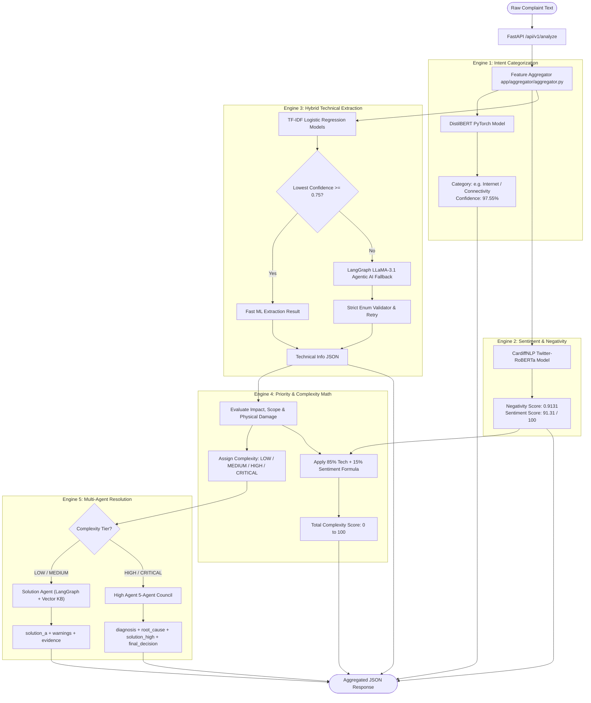

# 🤖 Telecom AI & ML Inference Service (`telecom-ai-service`)

A high-performance, stateless **AI/ML/NLP inference microservice** designed for real-time customer complaint triage, multi-class categorization, sentiment scoring, hybrid technical information extraction, automated complexity prioritization, and end-to-end **Multi-Agent Resolution & Escalation**.

---

## 🏗️ 1. High-Level AI Architecture Flow

When a complaint text is received at `POST /api/v1/analyze`, it passes through 4 parallel intelligence engines and automatically routes to the appropriate **Agent Pipeline**:



---

## 🤖 2. The Multi-Agent Systems in `telecom-ai-service`

The multi-agent system comprises three specialized, production-ready agent modules under `app/agents/`:

### 1. 💡 Solution Agent (`app/agents/solution/`)
* **Target Complexity**: `LOW` and `MEDIUM` complaints.
* **Architecture**: Sequential 3-stage LangGraph pipeline:
  1. `analyze_complaint`: Extracts customer symptoms and technical context.
  2. `retrieve_knowledge`: Queries Qdrant semantic vector index (with resilient local KB JSON fallback).
  3. `synthesize_solution`: Applies non-destructive customer safety checks and generates clear step-by-step instructions.
* **Output Artifacts**: `solution_a`, `warnings`, `evidence`, `confidence_score`.

---

### 2. ⚡ Escalation Agent (`app/agents/escalation/`)
* **Trigger**: Activated when customer submits feedback (`customer_feedback: false`).
* **Architecture**: Decision engine combining deterministic policy evaluation with LLM reasoning.
* **Evaluation Criteria**:
  - Unresolved customer feedback.
  - SLA duration ($\ge 7$ days overdue).
  - Scope escalation (`area` or `district`).
  - Imminent subscriber churn risk.
* **Action**: If escalated, automatically triggers the **High Agent Multi-Agent Council** and updates the ticket to `HIGH`/`CRITICAL` priority.

---

### 3. 🏛️ High Agent Multi-Agent Council (`app/agents/high/`)
* **Target Complexity**: `HIGH`, `CRITICAL`, or Escalated incidents.
* **Architecture**: 5 specialized collaborating sub-agents managed by a LangGraph StateGraph:
  1. 🩺 **Diagnosis Agent**: Pinpoints the failure domain, affected equipment, and preliminary root causes.
  2. 📜 **Policy Agent**: Checks SLA compliance, warranty thresholds, and executive regulatory protocols.
  3. ⚠️ **Risk Agent**: Computes churn likelihood and multi-subscriber impact scores.
  4. 🛠️ **Planner Agent**: Proposes technical intervention, line repair, or specialized field crew dispatch.
  5. ⚖️ **Critic Agent & Replan Loop**: Audits the plan for over/under-escalation and triggers iterative replanning if necessary.
* **Output Artifacts**: `diagnosis`, `root_cause`, `risk_level`, `policy_status`, `final_decision`, `solution_high`, `critic_feedback`.

---

## 🚀 3. Microservice Endpoints Overview

| Method | Endpoint | Description |
| :--- | :--- | :--- |
| `POST` | `/api/v1/analyze` | **Unified Master Inference**: Categorization + Sentiment + Extraction + Priority + Agent Resolution |
| `POST` | `/api/v1/categorize` | Predict category via fine-tuned DistilBERT classifier |
| `POST` | `/api/v1/sentiment` | Calculate negativity & sentiment scores via CardiffNLP RoBERTa |
| `POST` | `/api/v1/extract` | Extract structured technical metadata via Hybrid ML/LLM |
| `POST` | `/api/v1/agents/solution` | Direct execution of Solution Agent (customer self-care synthesis) |
| `POST` | `/api/v1/agents/escalate` | Direct execution of Escalation Agent on customer feedback |
| `POST` | `/api/v1/agents/high` | Direct execution of High Agent multi-agent council |
| `GET` | `/health` | Service health and model status check |

---

## 🧪 4. Testing & Validation

Run the comprehensive test suite with:

```bash
uv run pytest
```
* **Test Coverage**: 20 automated unit and integration tests passing with 100% success rate.
