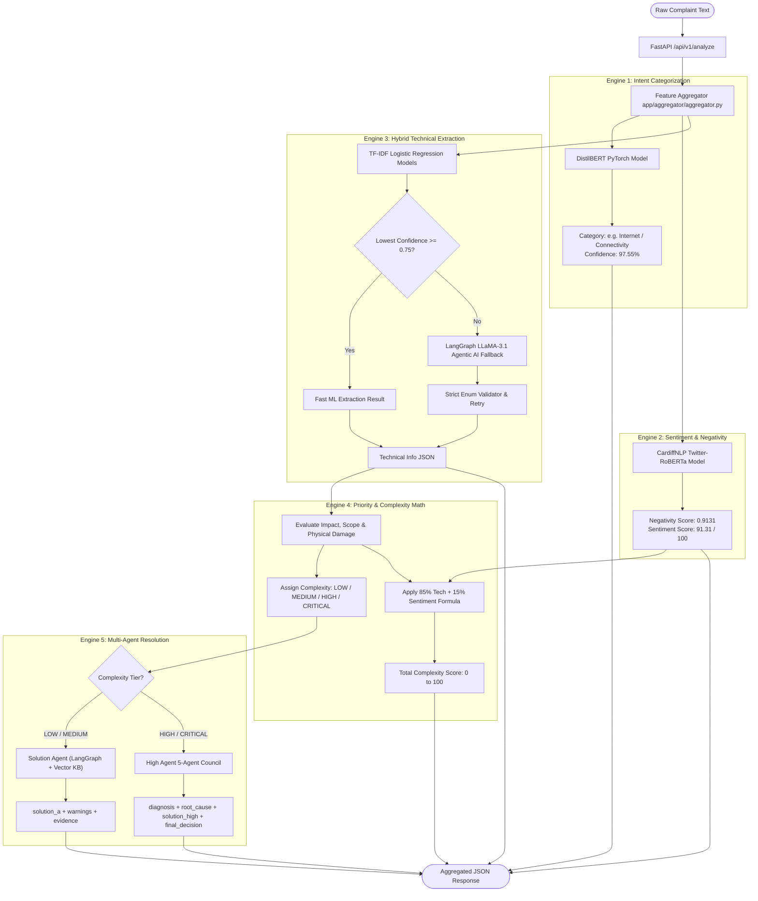

# 📊 Summary of Branch Changes: Krishanth_AI_Service & Krishanth_FeatureExtraction_BE

This document provides a comprehensive overview of the newly introduced features, database schemas, API routes, and agentic workflows across the AI/ML inference microservice and backend repositories.

---

## 🤖 1. AI Service Branch (`Krishanth_AI_Service`)
The `Krishanth_AI_Service` branch in the **`telecom-ai-service`** repository implements a stateless AI/ML inference microservice that runs on `http://localhost:8001`. It orchestrates intent classification, sentiment analysis, technical feature extraction, priority math, and a multi-agent hierarchy.

### 🏗️ Pipeline & Architectural Flow
Whenever raw complaint text is received (via `/api/v1/analyze`), it is processed through five parallel/sequential engines:

### 🧠 The Multi-Agent System
Three core agent systems are defined in `app/agents/`:
1. **💡 Solution Agent (`app/agents/solution/`)**:
   - **Target**: `LOW` and `MEDIUM` complexity complaints.
   - **Architecture**: A sequential 3-stage **LangGraph** pipeline (`analyze_complaint` $\rightarrow$ `retrieve_knowledge` $\rightarrow$ `synthesize_solution`). Queries a semantic **Qdrant Vector DB** index (with a robust local JSON backup for resiliency) to retrieve self-care resolutions.
2. **⚡ Escalation Agent (`app/agents/escalation/`)**:
   - **Trigger**: Runs when a customer submits negative feedback (`customer_feedback: false`).
   - **Evaluation**: Assesses SLA duration ($\ge 7$ days), scope escalation, and subscriber churn risk to switch ticket status and route to the **High Agent Council**.
3. **🏛️ High Agent Multi-Agent Council (`app/agents/high/`)**:
   - **Target**: `HIGH`, `CRITICAL`, or escalated incidents.
   - **Architecture**: 5 specialized collaborating sub-agents coordinated using a **LangGraph StateGraph**:
     - 🩺 **Diagnosis Agent**: Pins down root cause and failure domain.
     - 📜 **Policy Agent**: Assesses SLA status and regulatory protocols.
     - ⚠️ **Risk Agent**: Computes subscriber impact and churn probability.
     - 🛠️ **Planner Agent**: Proposes physical engineering dispatches.
     - ⚖️ **Critic Agent & Replan Loop**: Audits plans and runs feedback-driven replanning if details are missing.

---

## 📡 2. Backend Integration Branch (`Krishanth_FeatureExtraction_BE`)
The `Krishanth_FeatureExtraction_BE` branch in the **`telecom-backend`** repository connects the FastAPI backend to the inference service and manages persistence, database migrations, and Redis caching.

### 🔌 HTTP Client Integration (`app/services/ai_service.py`)
- Introduces `AIServiceClient` containing `analyze_complaint` and `escalate_complaint` wrappers.
- Sends payloads to `http://localhost:8001` with a resilient fallback dictionary in case the AI service is offline during local testing.

### 🚪 AI Proxy Router (`app/api/ai.py`)
Exposes dedicated proxy endpoints to interact directly with the microservice:
- `POST /api/v1/ai/analyze` $\rightarrow$ Unified Master Inference Pipeline.
- `POST /api/v1/ai/solution` $\rightarrow$ Solution Agent.
- `POST /api/v1/ai/escalate` $\rightarrow$ Escalation Agent.
- `POST /api/v1/ai/high` $\rightarrow$ High Agent Council.

### 💾 Database Schema Updates (Alembic Migrations)
A new migration (`98f40fd7dbf7_add_multi_agent_fields_and_customer_`) adds support for:
- Saving AI analysis fields: `diagnosis`, `root_cause`, `risk_level`, `policy_status`, `final_decision`, `critic_feedback`.
- Storing agent-generated answers: `solution_a` (low/medium self-care steps) and `solution_high` (high-priority engineering actions).

### ⚡ Redis Caching Middleware
To keep queries at sub-millisecond speeds, Redis caching is applied to:
- Individual ticket details (`complaint:{id}`).
- Customer specific lists (`user:{user_id}:complaints`).
- Global complexity lists (`complaints:all:{complexity}`).
- **Invalidation Hook**: Writing operations (`POST /me` or `PATCH /{id}`) automatically clear the corresponding cache keys to maintain consistency.

### 🧪 Testing
- **`tests/test_ai_routes.py`**: Validates proxy `/api/v1/ai/*` routes.
- **`tests/test_all_agents_end_to_end.py`**: Simulates complete customer flows from self-care generation through negative feedback triggers, escalation, and High Agent Council responses.
