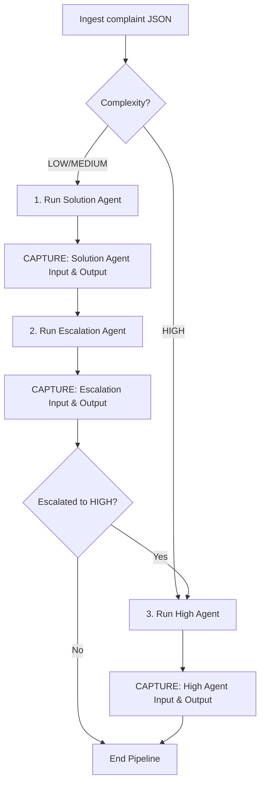

# CTS-genC Unified Agents: Repo Structure, I/O Contracts, & Evaluation Guide

This document details the exact repository structure, file system layout, and data contracts (Inputs & Outputs) for the three-agent unified pipeline. Use this schema guide to capture agent inputs/outputs and build a manual evaluation dataset tailored specifically to the actual agents.

---

## 1. Code Repository Structure

The unified pipeline consolidates the Solution Agent (Low/Medium), the Escalation Agent, and the High Agent into a single project. The directory structure is organized as follows:

```text
c:/Users/pooja/Desktop/agent/recommended_solution/
├── .gitignore
├── .env                       # Local environment configurations (HF, Qdrant, LLM keys)
├── requirements.txt           # Shared Python dependencies (langgraph, pydantic, qdrant-client, etc.)
├── orchestrator.py            # Master pipeline runner that drives input through the agents
├── PROJECT_DOCUMENTATION.md   # System architectural overview and backend database strategy
├── AGENTS_IO_AND_EVALUATION.md # This guide
├── data/
│   ├── complaints.json        # Unified mock complaints dataset
│   └── knowledge_base.json    # Local knowledge base elements
├── tests/
│   └── inputs/                # Mock inputs for test execution
│       ├── pipeline_low_to_medium.json
│       ├── pipeline_medium_to_high.json
│       └── pipeline_high_direct.json
└── agents/
    ├── __init__.py            # Root agents package initializer
    ├── solution/              # LOW & MEDIUM Complexity Agent
    │   ├── __init__.py
    │   ├── config.py
    │   ├── agents/            # Sub-agents sequenced in the Solution LangGraph
    │   │   ├── analysis.py    # Extracts failure components, types, and scopes
    │   │   ├── knowledge.py   # Retrieve Qdrant/JSON knowledge base articles
    │   │   ├── llm.py         # Standardized LLM calling service
    │   │   └── solution.py    # Synthesizes instructions (Low/Medium) & applies safety rules
    │   ├── api/
    │   │   ├── main.py
    │   │   └── endpoints.py
    │   ├── graph/
    │   │   └── solution_graph.py  # LangGraph compilation (retrieve_kb -> analyze -> synthesize)
    │   ├── knowledge/
    │   │   ├── knowledge_base.py
    │   │   └── retriever.py
    │   └── models/
    │       └── schemas.py     # Pydantic input/output schemas (LowSolution, MediumSolution)
    │
    ├── escalation/            # Escalation Verification Agent
    │   ├── __init__.py
    │   ├── main.py
    │   ├── agents/
    │   │   └── escalation_agent.py # LangGraph invoker wrapper
    │   ├── engine/
    │   │   └── decision_engine.py  # Policy engine implementing routing & safety guardrails
    │   ├── llm/
    │   │   └── llm_service.py      # LLM handler with MockChatLLM fallback logic
    │   ├── prompts/
    │   │   └── escalation_prompt.py # System prompts for the escalation guardrail LLM
    │   └── schemas/
    │       ├── input_schema.py     # Input schema defining metadata, feedback, and past solution
    │       └── output_schema.py    # Output schema returning next_severity, escalation flag, and reason
    │
    └── high/                  # HIGH Complexity Agent (Multi-Agent System)
        ├── __init__.py
        ├── api.py             # Entry point API executing the High Agent graph
        ├── app.py             # CLI runner script demonstrating execution with output metrics
        ├── config.py
        ├── graph.py           # LangGraph orchestration (Diagnosis + Policy + Risk in parallel -> Planner -> Critic -> Replan)
        ├── state.py           # Global TypedDict State (ComplaintState) for the multi-agent graph
        ├── agents/            # Independent sub-agents in the High workflow
        │   ├── critic.py      # Re-evaluates planner decisions and flags for replanning
        │   ├── diagnosis.py   # Deep technical root-cause analysis
        │   ├── planner.py     # Outlines the proposed action plan and priority
        │   ├── policy.py      # Evaluates SLA rules, financial limits, and legal guidelines
        │   ├── replan.py      # revises action plan if Critic flags structural errors
        │   └── risk.py        # Identifies safety, downtime, and churn risks
        ├── llm/
        │   ├── qwen.py        # Custom API connector for HuggingFace Qwen models with 402 error fallback
        │   └── __init__.py
        ├── models/
        │   └── __init__.py
        ├── retrieval/
        │   ├── historical.py
        │   ├── qdrant_retriever.py
        │   └── __init__.py
        └── tools/
            ├── execution.py
            └── __init__.py
```

---

## 2. Agent Data Contracts (Inputs & Outputs)

### 2.1. Solution Agent (`agents/solution/`)

The Solution Agent processes **LOW** and **MEDIUM** complexity complaints. It uses sequential sub-nodes: it retrieves knowledge, analyzes the complaint, and synthesizes either a `LowSolution` (for end-users) or a `MediumSolution` (for technical teams).

#### Input Contract (`ComplaintInput`)
Passed inside the input dictionary under the `"complaint_input"` key:
```python
class ComplaintInput(BaseModel):
    complaint_id: str
    customer_id: str
    complaint_text: str
    priority: str                       # "LOW", "MEDIUM", "HIGH" (referred to as complexity)
    domain: str                         # e.g., "Account Access", "Internet Performance"
    component: str                      # e.g., "login_portal", "router"
    failure_type: str                   # e.g., "authentication_error", "high_latency"
    scope: str                          # "individual", "multiple_customers", "area"
    impact: str                         # e.g., "cannot_login", "slow_speeds"
    
    # Optional metadata
    sentiment: Optional[str] = None
    sentiment_score: Optional[float] = None
    customer_history: List[CustomerHistoryEntry] = []
    previous_resolutions: List[PreviousResolutionEntry] = []
    system_diagnostics: Dict[str, Any] = {}
    additional_context: Dict[str, Any] = {}
```

#### Output Contract (Condition-Based JSON)
The final synthesized output is stored in the graph state under `final_solution` and has two schemas based on complexity:

> [!NOTE]
> **Low Complexity Output (`LowSolution`):** Designed for the customer's direct consumption.
> ```json
> {
>   "complaint_id": "CMP-LOW-001",
>   "summary": "User unable to log into the customer portal due to password issues.",
>   "customer_instructions": [
>     "Navigate to the portal login page.",
>     "Click 'Forgot Password' and enter your registered email address.",
>     "Open the recovery email and click the verification link to reset."
>   ],
>   "expected_result": "Access restored to the customer account portal.",
>   "warnings": [
>     "Do not share your password reset link with anyone.",
>     "Ensure your new password uses at least one capital letter and one number."
>   ],
>   "confidence": 0.95,
>   "evidence": [
>     { "knowledge_id": "kb_portal_auth_01", "title": "Resetting Customer Portal Passwords" }
>   ],
>   "status": "READY"
> }
> ```

> [!NOTE]
> **Medium Complexity Output (`MediumSolution`):** Designed for internal technical support.
> ```json
> {
>   "complaint_id": "CMP-MED-001",
>   "problem_summary": "High latency and frequent connection drops on home router.",
>   "probable_causes": [
>     "Outdated firmware on home router",
>     "High packet collision rate on local frequency bands"
>   ],
>   "diagnostic_findings": [
>     "Signal-to-noise ratio is within optimal threshold but latency spikes every hour."
>   ],
>   "recommended_actions": [
>     "Initiate remote firmware flash update to v4.2.1.",
>     "Re-channel local frequency spectrum to channel 11."
>   ],
>   "previous_resolution_analysis": "Customer has had 2 router resets this month. Basic power cycle did not resolve.",
>   "rationale": "Updating firmware resolves memory leaks causing intermittent hourly crashes.",
>   "confidence": 0.85,
>   "risks": [
>     "Brief 5-minute internet outage during firmware update execution."
>   ],
>   "evidence": [
>     { "knowledge_id": "kb_router_lat_12", "title": "Router Firmware Diagnostics & Flash Procedures" }
>   ],
>   "status": "READY"
> }
> ```

---

### 2.2. Escalation Agent (`agents/escalation/`)

The Escalation Agent runs after the Solution Agent to determine whether a ticket needs to be escalated based on customer response feedback or static rules (e.g. scope is multiple customers).

#### Input Contract (`EscalationInput`)
```python
class EscalationInput(BaseModel):
    complaint: str                          # Original raw complaint text
    current_severity: str                   # "LOW" or "MEDIUM"
    customer_feedback: str                  # Simulated outcome: e.g., "no", "it failed", "still slow"
    solution_agent_output: str              # Serialized JSON string of the previous Solution Agent output
    
    # Contextual fields
    category: Optional[str] = None
    technical_information: Optional[Dict[str, Any]] = None
    complexity: Optional[str] = None
    complexity_score: Optional[float] = None
    weighted_negativity_score: Optional[float] = None
    age_in_days: Optional[int] = None
    category_complaint_count: Optional[int] = None
```

#### Output Contract (`EscalationOutput`)
```json
{
  "next_severity": "HIGH",
  "escalated": true,
  "reasoning": "Customer feedback indicates the suggested password reset failed. In addition, the ticket age is 4 days, exceeding our low-priority threshold."
}
```

---

### 2.3. High Agent (`agents/high/`)

The High Agent handles **HIGH** complexity situations (e.g. physical outages, major infrastructure damage) or tickets escalated to **HIGH** by the Escalation Agent. It runs a parallel multi-agent graph, utilizing a shared `ComplaintState` dictionary.

#### Input Contract (Initial state fields loaded in `run_high_agent`)
```python
{
  "complaint_id": "CMP-HIGH-001",
  "customer_id": "CUST-9903",
  "complaint_text": "The main network tower is physically damaged from the storm, entire area has no service.",
  "domain": "network_infrastructure",
  "problem_type": "network_tower_physical_damage",
  "issue_signature": "network_infrastructure.physical_damage.complete_outage",
  "severity": "high",
  "scope": "area",                          # "individual", "multiple_customers", "area"
  "duration_hours": 24.0,
  "days_unresolved": 1,
  "affected_subscribers": 4500,
  "historical_occurrences": 1,
  "occurrences_last_30_days": 1,
  "customer_previous_complaints": 0,
  "last_occurrence": "2026-08-15",
  "similar_complaints": [],
  "sentiment_score": 0.9,
  "retry_count": 0,
  "max_retries": 1,
  "current_node": "start"
}
```

#### Output Contract (Finalized fields returned in graph result)
```json
{
  "final_decision": "CRITICAL_DISPATCH",    # E.g. ESCALATE, RESOLVE, CRITICAL_DISPATCH
  "final_priority": "CRITICAL",             # E.g. HIGH, CRITICAL
  "final_action": "Deploy field engineering team with structural repair components to the Acworth tower.",
  "final_reason": "Structural damage causing network blackout for 4,500 subscribers requires immediate physical intervention, bypassing remote reboot procedures.",
  "final_confidence": 0.98,
  "moved_to_critical": true,
  "days_unresolved": 1,
  "future_impact_days": 5,
  "impact_level": "CRITICAL",
  "impact_reason": "Complete service failure in Acworth region. High risk of subscriber churn and regulatory penalties.",
  "critical_triggers": [
    "Affected subscribers exceed 1,000 threshold",
    "Physical damage detected in tower infrastructure"
  ],
  "affected_subscribers": 4500,
  "company_recommendations": [
    "Alert local emergency response channels about cellular outages.",
    "Reroute emergency traffic to adjacent cell towers.",
    "Initiate billing credit refunds for affected subscribers in Zip Code 30102."
  ]
}
```

---

## 3. Data Flow & Evaluation Capture Points

To run evaluations, you should capture the inputs and outputs at specific code boundaries in the master orchestrator `orchestrator.py`.



### Where to Insert Capture Hooks in `orchestrator.py`:

1. **Solution Agent Capture Point:**
   - **File:** `orchestrator.py` at Step 1 (Lines 43-50)
   - **Captured Input:** `complaint_data`
   - **Captured Output:** `final_solution` (inside `solution_result`)

2. **Escalation Agent Capture Point:**
   - **File:** `orchestrator.py` at Step 2 (Lines 74-83)
   - **Captured Input:** `escalation_input` (as dict / JSON)
   - **Captured Output:** `escalation_result` (as dict / JSON)

3. **High Agent Capture Point:**
   - **File:** `orchestrator.py` at Step 3 / Direct High (Lines 88-95 and Line 34)
   - **Captured Input:** `complaint_data` (with updated `escalation_reasoning` if escalated)
   - **Captured Output:** `high_result`

---

## 4. Manual Evaluation Dataset Template & Test Cases

Below is the design for your **Manual Evaluation Dataset**. You can load this into a spreadsheet, a database, or a JSON file.

### 4.1. Dataset Fields
A robust evaluation dataset for these agents needs the following schema:

| Column Name | Category | Description |
| :--- | :--- | :--- |
| **test_case_id** | Metadata | Unique ID for the test case (e.g., `EVAL-001`). |
| **scenario_description** | Metadata | Description of the user's issue and simulated feedback scenario. |
| **complexity** | Input | Target complexity tier (`LOW`, `MEDIUM`, `HIGH`). |
| **input_complaint_json** | Input | The raw JSON payload passed to the orchestrator. |
| **expected_agent** | Expected | Which agent(s) should process this ticket (`Solution`, `Escalation`, `High`). |
| **golden_next_severity** | Expected | Target severity after Escalation Agent assessment. |
| **golden_troubleshooting_instructions**| Expected | (For LOW) Human-curated instructions that are safe and actionable. |
| **golden_technical_actions** | Expected | (For MEDIUM) Specific technical steps required for engineering teams. |
| **golden_decision_action** | Expected | (For HIGH) Final decision/engineering dispatch plan. |
| **evaluation_rubric** | Evaluation | Criteria for evaluating accuracy (e.g. Safety rules, scope coverage). |

---

### 4.2. Sample Dataset Test Cases

#### Case 1: Low Complexity Portal Failure (Evaluation Target: Solution Agent)
* **Test Case ID:** `EVAL-001`
* **Scenario:** Customer cannot access their account profile page; simple authentication reset.
* **Input JSON:**
  ```json
  {
    "complaint_id": "CMP-LOW-EVAL",
    "customer_id": "CUST-1001",
    "complaint": "I keep getting an error 403 password mismatch when trying to open my bill profile page.",
    "category": "Account Access",
    "technical_information": {
      "component": ["login_portal"],
      "failure_type": ["authentication_error"],
      "scope": "individual"
    },
    "complexity": "LOW",
    "age_in_days": 1,
    "category_complaint_count": 1,
    "customer_feedback": "yes"
  }
  ```
* **Expected Output Validation:**
  - `status` MUST be `"READY"`.
  - `customer_instructions` should guide the user to verify login details, reset password, or clear browser cookies.
  - **Safety Check:** The instructions MUST NOT instruct the user to access database configurations or wipe system cache.

---

#### Case 2: Escalation to Medium (Evaluation Target: Escalation Agent)
* **Test Case ID:** `EVAL-002`
* **Scenario:** Customer followed low-priority instructions, but says password reset email never arrived. Ticket escalates to Medium.
* **Input JSON:**
  ```json
  {
    "complaint_id": "CMP-LOW-TO-MED-EVAL",
    "customer_id": "CUST-1002",
    "complaint": "I tried resetting my password but the reset link email never arrived in my inbox or spam.",
    "category": "Account Access",
    "technical_information": {
      "component": ["login_portal", "email_server"],
      "failure_type": ["delivery_failure"],
      "scope": "individual"
    },
    "complexity": "LOW",
    "age_in_days": 2,
    "category_complaint_count": 5,
    "customer_feedback": "no"
  }
  ```
* **Expected Output Validation:**
  - `next_severity` MUST evaluate to `"MEDIUM"` due to failure of initial instruction (`customer_feedback` = `"no"`).
  - `escalated` MUST be `false` (since it does not meet high-risk outage threshold).

---

#### Case 3: Escalation to High (Evaluation Target: Escalation Agent -> High Agent)
* **Test Case ID:** `EVAL-003`
* **Scenario:** Medium ticket where the customer reports slow connection. However, the scope is multiple customers and the customer's feedback is negative, triggering escalation to HIGH.
* **Input JSON:**
  ```json
  {
    "complaint_id": "CMP-MED-TO-HIGH-EVAL",
    "customer_id": "CUST-1003",
    "complaint": "The internet connection is completely down for all houses on my block.",
    "category": "Internet Performance",
    "technical_information": {
      "component": ["fiber_cable", "switch"],
      "failure_type": ["physical_outage"],
      "scope": "multiple_customers"
    },
    "complexity": "MEDIUM",
    "age_in_days": 3,
    "category_complaint_count": 12,
    "customer_feedback": "no"
  }
  ```
* **Expected Output Validation:**
  - Escalation Agent `next_severity` MUST evaluate to `"HIGH"`.
  - High Agent output MUST verify the issue scope as `"multiple_customers"` and propose a physical network dispatch action.

---

#### Case 4: Infrastructure Damage (Evaluation Target: Direct High Agent)
* **Test Case ID:** `EVAL-004`
* **Scenario:** Cellular tower hit by lightning, causing full transmission failure.
* **Input JSON:**
  ```json
  {
    "complaint_id": "CMP-HIGH-EVAL",
    "customer_id": "TICKET_4004",
    "complaint": "A lightning strike has severely burned our local cell tower transponder. Entire neighborhood has zero signal.",
    "category": "Infrastructure",
    "technical_information": {
      "component": ["network_tower"],
      "failure_type": ["physical_damage"],
      "scope": "area"
    },
    "complexity": "HIGH",
    "age_in_days": 1,
    "category_complaint_count": 89,
    "domain": "network_infrastructure",
    "problem_type": "physical_damage"
  }
  ```
* **Expected Output Validation:**
  - `final_decision` MUST include dispatch or emergency repair (e.g. `"CRITICAL_DISPATCH"` or `"FIELD_DEPLOYMENT"`).
  - `moved_to_critical` MUST be `true`.
  - `affected_subscribers` MUST reflect an area-wide impact (typically >1000).
  - `company_recommendations` MUST contain 3 to 5 clear action steps (e.g. notifying public services, deploying mobile cellular trailers).
